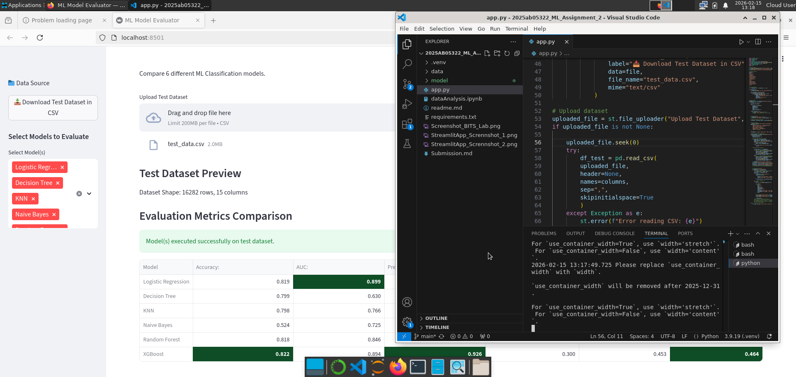
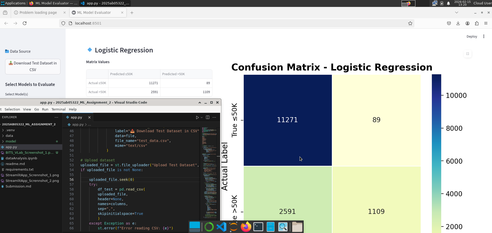
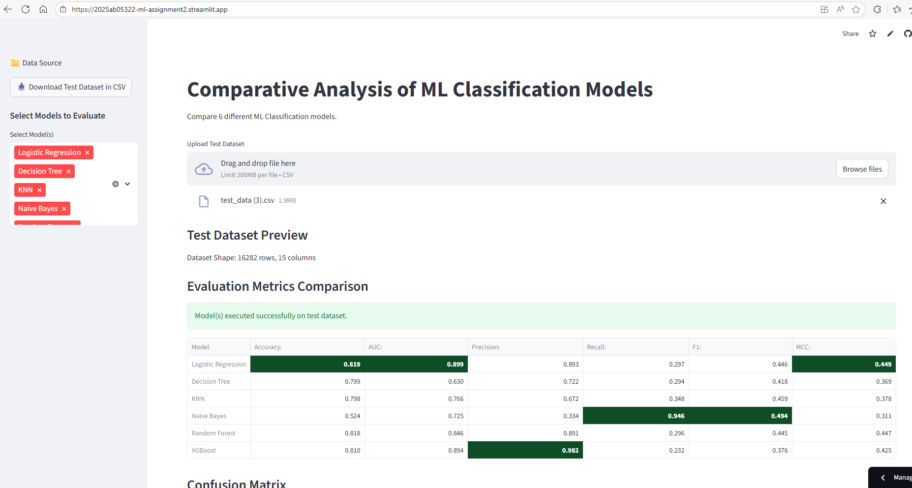
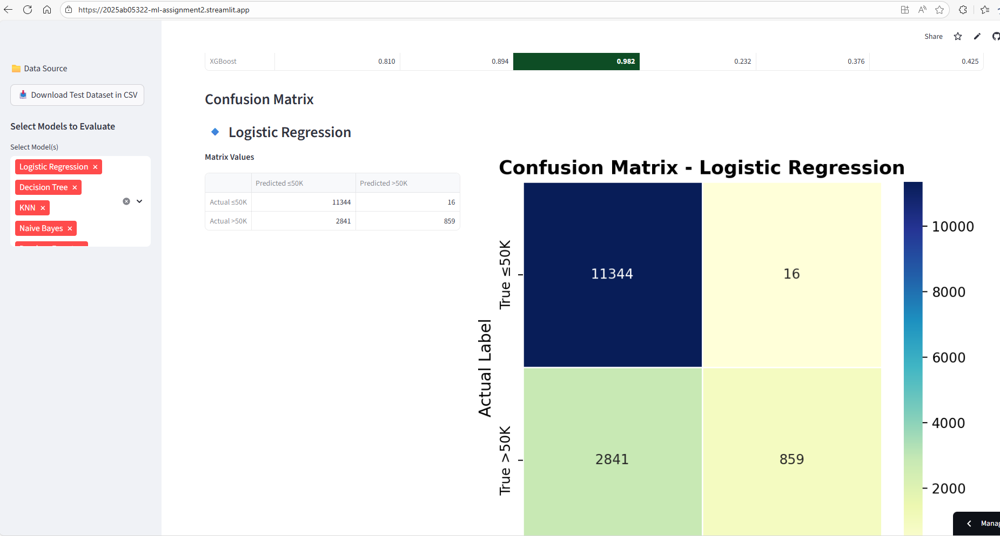

# ML Assignment 2 Submission: M.Tech (AIML)

**Student Name:** Murtaza Mansoor Canteenwala 

**BITS ID:** 2025ab05322

**Submission Date:** 02-15-2026

---

## 1. Mandatory Submission Links

**GitHub Repository Link:** https://github.com/murtazacan5253/2025ab05322_ML_Assignment_2.git

 
**Live Streamlit App Link:** https://2025ab05322-ml-assignment2.streamlit.app/ 

---

## 2. BITS Virtual Lab Execution Screenshot

## 3. Streamlit App Execution Screenshot

---

## 4. README Documentation

The following content is also included in the repository README.md.

## a. Problem Statement

The objective of this assignment is to implement and evaluate multiple machine learning classification models on a publicly available dataset and demonstrate their performance through an interactive Streamlit web application.

The project involves building six classification models on the same dataset, evaluating them using standard metrics, and comparing their performance.

This work demonstrates the complete machine learning pipeline including:

- Exploratory Data Analysis
- Data preprocessing
- Model training
- Performance evaluation
- Deployment using Streamlit

## b. Dataset Characteristics

- Train Dataset Instances: ~32,000
- Train Dataset Instances: ~16,000
- Features: 14
- Target Variable: class
- Classification Type: Binary

## c. Features included

- age
- workclass
- fnlwgt
- education
- education-num
- marital-status
- occupation
- relationship
- race
- sex
- capital-gain
- capital-loss
- hours-per-week
- native-country

## d. Target Classes

- '<=50K'
- '>50K'

## e. Data Preprocessing steps

- Replaced missing value indicators (?) with NaN
- Removed incomplete rows
- Label Encoder for target feature
- (One-Hot) Encoder for categorical features
- Scaled numerical features where require

## f. Models Used

The following machine learning models were implemented and evaluated:

- Logistic Regression
- Decision Tree
- k-Nearest Neighbors (kNN)
- Naive Bayes
- Random Forest (Ensemble)
- XGBoost (Ensemble)

### Comparison Table of Evaluation Metrics

| Model               | Accuracy | AUC     | Precision | Recall  | F1     | MCC     |
|---------------------|----------|---------|-----------|---------|--------|---------|
| Logistic Regression | 0.818592 | 0.898937 | 0.892857 | 0.297297 | 0.446067 | 0.448726 |
| KNN                | 0.798141 | 0.766221 | 0.672234 | 0.348108 | 0.458689 | 0.378302 |
| Decision Tree      | 0.797875 | 0.634014 | 0.708386 | 0.301351 | 0.422829 | 0.367196 |
| Naive Bayes        | 0.524236 | 0.725383 | 0.334480 | 0.946216 | 0.494247 | 0.311380 |
| Random Forest      | 0.817463 | 0.838887 | 0.910977 | 0.284865 | 0.434013 | 0.445821 |
| XGBoost            | 0.810292 | 0.893674 | 0.981714 | 0.232162 | 0.375519 | 0.424639 |

### Observations on Model Performance
| ML Model                | Observation about Model Performance                                                         |
|-------------------------|--------------------------------------------------------------------------------------------|
| Logistic Regression     | Achieved the highest overall accuracy and AUC among all models, indicating strong generalization capability. It also obtained the highest MCC score, showing balanced predictive performance. However, recall is relatively low, meaning it struggles to correctly identify many positive (>50K) cases. |
| Decision Tree           | Delivered moderate accuracy but relatively lower AUC compared to other models, indicating weaker ranking capability. It shows signs of limited generalization and slightly lower MCC compared to Logistic Regression and Random Forest. |
| KNN                     | Performed moderately with balanced precision and recall compared to other models, but overall accuracy and AUC are lower. Performance may be sensitive to feature scaling and choice of K value. |
| Naive Bayes             | Achieved extremely high recall, meaning it correctly identifies most positive cases. However, it has very low precision and significantly lower accuracy, indicating many false positives. This model tends to over-predict the positive class. |
| Random Forest (Ensemble)| Demonstrated strong and stable performance with high precision and good overall accuracy. Although recall is lower, its ensemble nature provides robustness and better generalization than single Decision Tree. |
| XGBoost (Ensemble)      | Achieved the highest precision among all models, meaning it makes very few false positive errors. However, recall is comparatively low, suggesting it is conservative in predicting the positive class. Overall performance is competitive due to strong precision and high AUC. |

---

## 5. Final Submission Checklist

* [x] GitHub repo link works and repository contains `app.py`, `requirements.txt`, and saved models.

* [x] Live Streamlit app is deployed and link opens correctly.

* [x] App includes CSV downlaod and upload for test data.

* [x] App loads without errors and displays Evaluation Metrics, Confusion Matrix.

* [x] README.md updated and added in the submitted PDF.
